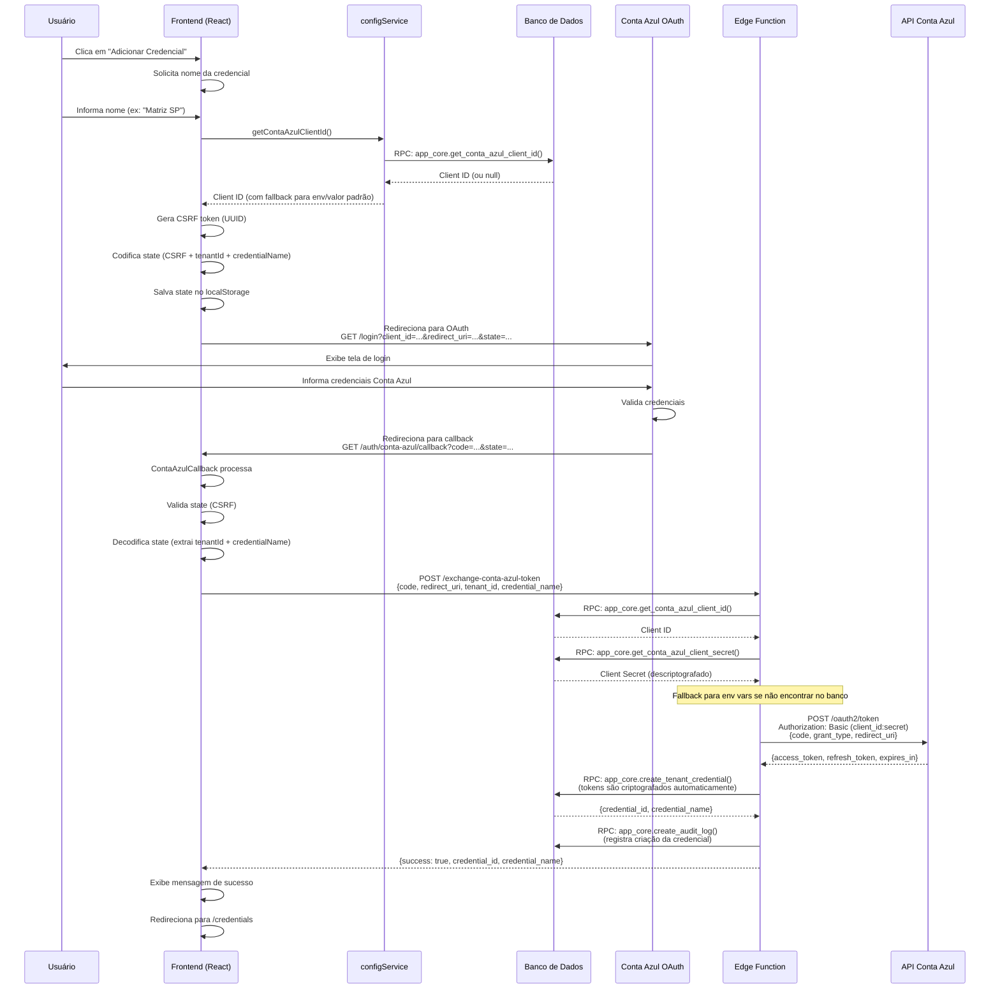

# Processo de Autenticação Conta Azul

## Visão Geral

O processo de autenticação utiliza OAuth 2.0 Authorization Code Flow, garantindo segurança ao manter o Client Secret apenas no servidor (Edge Function). O Client ID agora é obtido do banco de dados, permitindo configuração centralizada.

## Fluxo Completo

## Componentes Envolvidos

### 1. Frontend - Inicialização (`services/contaAzulAuthService.ts`)

**Método:** `initiateAuth(tenantId, credentialName)`

**O que faz:**
1. Busca Client ID do banco via `getContaAzulClientId()` (com fallback)
2. Gera token CSRF (UUID)
3. Codifica state: `{csrf, tenantId, credentialName}` → Base64
4. Salva state no `localStorage` para validação posterior
5. Redireciona para Conta Azul OAuth com parâmetros:
   - `client_id`: Client ID obtido do banco
   - `redirect_uri`: URL de callback (normalizada, sem hash)
   - `state`: State codificado
   - `scope`: `openid profile aws.cognito.signin.user.admin`

**Arquivo:** `services/contaAzulAuthService.ts` (linhas 96-132)

### 2. Frontend - Callback (`pages/ContaAzulCallback.tsx`)

**O que faz:**
1. Captura parâmetros OAuth da URL (`code`, `state`, `error`)
2. Valida state CSRF (compara com `localStorage`)
3. Decodifica state para extrair `tenantId` e `credentialName`
4. Chama Edge Function para trocar code por tokens
5. Exibe resultado (sucesso/erro) e redireciona

**Arquivo:** `pages/ContaAzulCallback.tsx` (linhas 35-185)

### 3. Edge Function - Troca de Tokens (`supabase/functions/exchange-conta-azul-token/index.ts`)

**O que faz:**
1. Valida parâmetros recebidos (`code`, `redirect_uri`, `tenant_id`, `credential_name`)
2. **Valida tenant:** Verifica se tenant existe e está ativo (`status = 'ACTIVE'`)
3. Busca Client ID e Client Secret do banco:
   - `app_core.get_conta_azul_client_id()` → Client ID (público)
   - `app_core.get_conta_azul_client_secret()` → Client Secret (criptografado, descriptografado automaticamente)
4. Fallback para variáveis de ambiente se não encontrar no banco
5. Troca authorization code por tokens na API Conta Azul:
   - `POST https://auth.contaazul.com/oauth2/token`
   - Authorization: Basic (client_id:client_secret)
6. Salva credenciais no banco via RPC:
   - `app_core.create_tenant_credential()`
   - Tokens são criptografados automaticamente
   - **Reativa credencial automaticamente:** Se credencial já existia e estava inativa, é reativada (`is_active = true`, `revoked_at = NULL`)
7. Cria log de auditoria
8. Retorna sucesso (sem expor tokens)

**Arquivo:** `supabase/functions/exchange-conta-azul-token/index.ts`

### 4. Edge Function - Obter Token Válido (`supabase/functions/get-valid-token/index.ts`)

**O que faz:**
1. Recebe `credential_id` na requisição
2. Busca credencial descriptografada via RPC `app_core.get_tenant_credential_decrypted()`
3. Busca Client ID/Secret do banco (com fallback para env vars)
4. **Sempre renova o token** (independente de estar válido) para evitar problemas de estourar 1h
5. Se refresh token for inválido:
   - Marca credencial como inativa (`is_active = false`)
   - Retorna flag `needs_reauth: true`
   - Inclui `credential_id` e `credential_name` na resposta
   - Cria log de auditoria
6. Se renovação bem-sucedida:
   - Atualiza tokens no banco
   - Retorna novo access_token com 1h de validade

**Arquivo:** `supabase/functions/get-valid-token/index.ts`

### 5. Edge Function - Webhook de Revogação (`supabase/functions/conta-azul-webhook/index.ts`)

**O que faz:**
1. Recebe webhook da Conta Azul quando token é revogado
2. Valida webhook secret (se configurado)
3. Identifica credencial via `credential_id` ou `tenant_id`
4. Chama função RPC `app_core.revoke_tenant_credential()` para revogar
5. Atualiza `revoked_at` e `is_active = false`
6. Cria log de auditoria
7. Retorna sucesso (idempotente se já estava revogada)

**Arquivo:** `supabase/functions/conta-azul-webhook/index.ts`

### 4. Banco de Dados - Armazenamento

**Tabela:** `app_core.tenant_credentials`

**Campos importantes:**
- `tenant_id`: ID do cliente
- `credential_name`: Nome amigável (ex: "Matriz SP")
- `access_token`: Token de acesso (criptografado)
- `refresh_token`: Token de refresh (criptografado)
- `token_expires_at`: Data de expiração
- `is_active`: Se a credencial está ativa
- `revoked_at`: Data em que a credencial foi revogada (NULL = ativa)
- `last_authenticated_at`: Última autenticação bem-sucedida

**Segurança:**
- Tokens são criptografados automaticamente via função RPC
- RLS garante isolamento por tenant
- Apenas parceiros podem ver credenciais de seus tenants

## Configurações Necessárias

### 1. Client ID e Client Secret

**Onde são salvos:**
- **Banco de dados:** `app_core.app_config` (salvos automaticamente durante setup)
  - `conta_azul_client_id` (não criptografado - público)
  - `conta_azul_client_secret` (criptografado)

**Como são obtidos:**
- **Frontend:** Via `configService.getContaAzulClientId()` → RPC `app_core.get_conta_azul_client_id()`
- **Edge Function:** Via RPC `app_core.get_conta_azul_client_id()` e `app_core.get_conta_azul_client_secret()`

**Fallback:**
- Se não encontrar no banco, usa variáveis de ambiente:
  - Frontend: `VITE_CONTA_AZUL_CLIENT_ID` ou valor padrão
  - Edge Function: `CA_CLIENT_ID`/`CA_CLIENT_SECRET` ou `CONTA_AZUL_CLIENT_ID`/`CONTA_AZUL_CLIENT_SECRET` (ambas as convenções são aceitas)

### 2. Redirect URI

**Formato:**
- **Produção:** `https://seu-dominio.com/auth/conta-azul/callback`
- **Desenvolvimento:** `http://localhost:5173/auth/conta-azul/callback`

**⚠️ IMPORTANTE:**
- Deve estar cadastrado EXATAMENTE IGUAL no app da Conta Azul
- NÃO usar hash (`#`) na URL
- URL é normalizada (remove trailing slash) para garantir consistência

**Configuração:**
- Variável de ambiente: `VITE_CONTA_AZUL_REDIRECT_URI`
- Fallback: `${window.location.origin}/auth/conta-azul/callback`

## Segurança

### Proteções Implementadas

1. **CSRF Protection:**
   - State token gerado com UUID
   - Validado no callback antes de trocar tokens

2. **Client Secret Seguro:**
   - Nunca exposto no frontend
   - Armazenado criptografado no banco
   - Apenas Edge Function (server-side) acessa

3. **Tokens Criptografados:**
   - Access tokens e refresh tokens são criptografados no banco
   - Criptografia automática via função RPC

4. **Isolamento por Tenant:**
   - RLS garante que parceiros vejam apenas suas credenciais
   - Validação de tenant_id antes de salvar

5. **Auditoria:**
   - Log de todas as criações de credenciais
   - Log de falhas de refresh token
   - Log de revogações via webhook
   - Rastreabilidade completa

6. **Validação de Tenant:**
   - Tenant é validado antes de criar credencial
   - Apenas tenants ativos (`status = 'ACTIVE'`) podem criar credenciais
   - Previne criação de credenciais para tenants inválidos

## Múltiplas Credenciais por Tenant

O sistema suporta múltiplas credenciais Conta Azul por tenant, cada uma com um nome amigável:

- **Exemplo:** Um tenant pode ter:
  - "Matriz SP" (credencial principal)
  - "Filial RJ" (credencial secundária)
  - "Filial MG" (credencial terciária)

**Validação:**
- Nome deve ser único por tenant (constraint no banco)
- Nome é obrigatório ao criar credencial

## Fluxo de Erros

### Erros Comuns

1. **Client ID não encontrado:**
   - Frontend: Usa fallback (env var ou valor padrão)
   - Edge Function: Retorna erro 500 se não encontrar no banco nem env vars

2. **State inválido:**
   - Callback valida state antes de processar
   - Retorna erro de segurança se state não corresponder

3. **Nome duplicado:**
   - Edge Function detecta constraint violation
   - Retorna erro específico: "Já existe uma credencial com o nome..."

4. **Erro na API Conta Azul:**
   - Edge Function captura erro da API
   - Retorna erro genérico (não expõe detalhes sensíveis)

5. **Refresh Token Inválido:**
   - `get-valid-token` retorna `needs_reauth: true`
   - Inclui `credential_id` e `credential_name` na resposta
   - Credencial é marcada como inativa automaticamente
   - Frontend pode detectar e mostrar aviso de reautenticação

6. **Tenant Inválido:**
   - `exchange-conta-azul-token` valida tenant antes de criar credencial
   - Retorna erro 404 se tenant não encontrado
   - Retorna erro 403 se tenant está inativo ou suspenso

## Melhorias Recentes

### ✅ Client ID do Banco de Dados

**Antes:**
- Client ID hardcoded no frontend
- Client Secret em variáveis de ambiente (Edge Functions)

**Agora:**
- Client ID buscado do banco via `configService`
- Client Secret buscado do banco via Edge Function
- Fallback para env vars durante transição
- Configuração centralizada e atualizável sem redeploy

### ✅ Cache de Client ID

- Client ID é cacheado no frontend (5 minutos TTL)
- Evita múltiplas queries desnecessárias
- Cache pode ser limpo manualmente se necessário

## Melhorias Implementadas

### ✅ Refresh Token Sempre Renovado

**Comportamento:**
- Token sempre é renovado quando solicitado (independente de estar válido)
- Evita problemas de token próximo de expirar durante uso
- Client ID/Secret obtidos do banco de dados (com fallback para env vars)

**Benefícios:**
- Sempre retorna token com tempo máximo de validade (1h)
- Configuração centralizada no banco de dados
- Não precisa verificar expiração antes de renovar

### ✅ Tratamento de Reautenticação

**Quando refresh token é inválido:**
- Credencial é marcada como inativa (`is_active = false`)
- Resposta inclui flag `needs_reauth: true`
- Inclui `credential_id` e `credential_name` para facilitar identificação
- Mensagem clara: "Credencial precisa ser reautenticada"
- Log de auditoria criado automaticamente

**Quando credencial é reautenticada:**
- Credencial é automaticamente reativada (`is_active = true`)
- Campo `revoked_at` é limpo (NULL)
- `last_authenticated_at` é atualizado
- Não precisa intervenção manual

### ✅ Validação de Tenant

**Implementação:**
- Tenant é validado antes de criar credencial
- Verifica se tenant existe na tabela `app_core.tenants`
- Verifica se tenant está ativo (`status = 'ACTIVE'`)
- Retorna erro 404 se tenant não encontrado
- Retorna erro 403 se tenant está inativo ou suspenso

**Benefícios:**
- Segurança: Previne criação de credenciais para tenants inválidos
- Código mais limpo: Remove código morto
- Melhor tratamento de erros

### ✅ Webhook de Revogação

**Funcionalidade:**
- Recebe webhooks da Conta Azul quando tokens são revogados
- Valida webhook secret (se configurado)
- Identifica credencial via `credential_id` ou `tenant_id`
- Chama função RPC `app_core.revoke_tenant_credential()` para revogar
- Atualiza `revoked_at` e `is_active = false`
- Cria log de auditoria
- Idempotente (não erro se já estava revogada)

**Configuração:**
- Edge Function: `conta-azul-webhook`
- Variável de ambiente opcional: `WEBHOOK_SECRET`
- Header de autenticação: `x-webhook-secret`

## Funções RPC Disponíveis

### `app_core.revoke_tenant_credential(p_credential_id UUID, p_reason TEXT)`

Revoga uma credencial, marcando-a como revogada e inativa.

**Parâmetros:**
- `p_credential_id`: ID da credencial a ser revogada
- `p_reason`: Motivo da revogação (opcional)

**Retorna:**
- Dados da credencial revogada (id, tenant_id, platform, credential_name, is_active, revoked_at, updated_at)

**Comportamento:**
- Marca `revoked_at = NOW()` e `is_active = FALSE`
- Atualiza status de conexão do tenant (verifica se há outras credenciais ativas)
- Cria log de auditoria automaticamente
