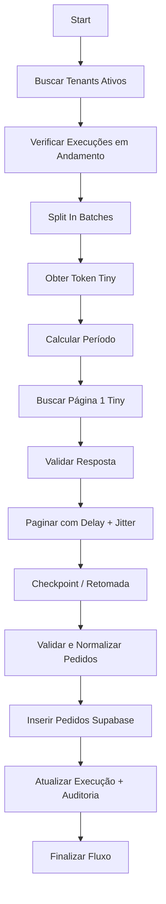

# 🧠 Fluxo 1 – Pesquisar Pedidos (Tiny API) – Versão 3 (Otimizada)

Fluxo responsável por consultar pedidos da **API Tiny** (`pedidos.pesquisa.php`) para cada tenant ativo, 
controlando paginação, respeitando limites de requisição e salvando resultados no Supabase.

Agora com suporte aprimorado para **carga inicial (30 dias)**, **atualização diária**, **checkpoint de paginação**, 
**auditoria avançada**, **bloqueio de concorrência**, e **controle de execução modular**.

---

## 🎯 Objetivo

1. Realizar **carga inicial** (últimos 30 dias, a partir de ontem) na primeira execução.  
2. Executar **atualizações diárias** subsequentes (somente o dia anterior).  
3. Respeitar limites do plano Tiny, com controle por tenant.  
4. Garantir **idempotência, resiliência e rastreabilidade total** via Supabase.  
5. Permitir retomada via **checkpoints** e prevenção de **execuções simultâneas duplicadas**.

---

## 🗺️ Diagrama do Fluxo (Simplificado)



---

## ⚙️ Estrutura do Fluxo

| Ordem | Node | Função |
|--------|-------|--------|
| 1️⃣ | **Start** | Início manual ou agendado |
| 2️⃣ | **Supabase → Buscar Tenants Ativos** | Lista tenants ativos e planos Tiny |
| 3️⃣ | **Supabase → Verificar Execuções Ativas** | Evita duplicidade de execução |
| 4️⃣ | **Split In Batches** | Processa um tenant por vez |
| 5️⃣ | **HTTP Request → Obter Token Tiny** | Obtém token descriptografado do Supabase Edge |
| 6️⃣ | **Function → Calcular Período** | Define carga inicial ou diária |
| 7️⃣ | **HTTP Request → Buscar Página 1 (Tiny)** | Primeira requisição Tiny |
| 8️⃣ | **Function → Validar Resposta** | Verifica status e estrutura |
| 9️⃣ | **Function → Paginar Resultados (com Jitter)** | Busca páginas subsequentes com atraso aleatório |
| 🔟 | **Function → Checkpoint Paginação** | Registra progresso em caso de falha |
| 11️⃣ | **Function → Validar e Normalizar Pedidos** | Formata e valida dados antes de inserir |
| 12️⃣ | **Supabase → Inserir Pedidos (RPC)** | Inserção em lote dos pedidos válidos |
| 13️⃣ | **Supabase → Atualizar Execução e Auditoria** | Marca execução como concluída |
| 14️⃣ | **Supabase → Atualizar Tenant / Checkpoint Final** | Atualiza status do tenant |
| 15️⃣ | **Error Handler / Notificação** | Notifica e loga erros no Supabase ou Slack |

---

## 🧩 Principais Melhorias

### ✅ Modularização (Controller / Worker)
Separar a orquestração (controller) da execução de tenants (worker):

- **Controller Workflow:** Busca tenants, cria execuções, chama o worker.
- **Worker Workflow:** Processa um tenant individual (pode ser reexecutado isoladamente).

Uso do node **“Execute Workflow”** para chamar o worker com:
```json
{
  "tenant_id": "...",
  "token": "...",
  "primeira_execucao": false,
  "limite_por_minuto": 60
}
```

---

### ✅ Controle de Concorrência

Antes de processar cada tenant:

```sql
SELECT COUNT(*) 
FROM platform_executions 
WHERE tenant_id = '{{ $json.tenant_id }}' 
  AND status = 'RUNNING' 
  AND execution_type = 'PEDIDOS_PESQUISA';
```

Se resultado > 0 → abortar tenant e registrar log de aviso.

---

### ✅ Paginação com Rate Limit e Jitter

Ajuste para evitar requisições simultâneas de múltiplos tenants (mitiga throttling Tiny).

```javascript
const delayMs = Math.ceil(60000 / limite_por_minuto);
const jitter = Math.random() * 500; // até 0.5s extra
await new Promise(r => setTimeout(r, delayMs + jitter));
```

---

### ✅ Checkpoints de Paginação

Nova tabela Supabase: `sync_checkpoints`

| Campo | Tipo | Descrição |
|--------|------|------------|
| tenant_id | UUID | Tenant sendo sincronizado |
| data_inicial | DATE | Data inicial da busca |
| data_final | DATE | Data final da busca |
| ultima_pagina | INT | Última página sincronizada |
| status | TEXT | PENDING / COMPLETED / ERROR |
| atualizado_em | TIMESTAMP | Última atualização |

Durante a paginação:
- Atualizar `ultima_pagina` a cada página concluída.
- Se falhar, a retomada começa da próxima página.

---

### ✅ Ajuste de Fuso Horário

Tiny usa horário de **Brasília (UTC-3)**.  
Adicione no node “Calcular Período”:

```javascript
const offset = -3;
const hoje = new Date(new Date().setHours(new Date().getUTCHours() + offset));
```

---

### ✅ Auditoria e Métricas

Expandir `create_audit_log` para registrar:

| Campo | Descrição |
|--------|------------|
| total_api_calls | Total de requisições Tiny |
| avg_response_time_ms | Tempo médio de resposta |
| total_items | Total de pedidos processados |
| total_errors | Páginas com erro |
| duration_sec | Tempo total da execução |
| data_range | Ex: "2025-11-09 → 2025-12-08" |

Esses dados podem ser usados em dashboards (Supabase + Grafana).

---

### ✅ Inserção Otimizada no Supabase

Reduzir múltiplas chamadas RPC em uma única função agregada:

```sql
SELECT finalize_tiny_sync(
  p_tenant_id := '{{ $json.tenant_id }}',
  p_execution_data := '{{ JSON.stringify($json) }}'::jsonb
);
```

Essa RPC:
1. Insere os pedidos (batch)
2. Atualiza `platform_executions`
3. Cria log de auditoria
4. Atualiza `sync_jobs`

💡 Menos latência e mais atomicidade.

---

### ✅ Notificações Automáticas

Criar fluxo separado **“Error Notification Workflow”**, disparado via `Error Trigger`:

Exemplo payload:
```json
{
  "tenant_id": "uuid-tenant-1",
  "erro": "Token inválido",
  "etapa": "HTTP Request - Página 1",
  "data": "2025-12-09T02:00:00Z",
  "workflow": "tiny_pedidos_pesquisa"
}
```

Enviar para:
- Slack (Webhook)
- Discord
- Email via SMTP
- Supabase table `error_logs`

---

## ✅ Resultado Final

- **Primeira execução:** busca dos **últimos 30 dias a partir de ontem**.  
- **Execuções seguintes:** busca apenas **o dia anterior**.  
- **Checkpoints garantem retomada segura.**  
- **Auditoria e métricas detalhadas** no Supabase.  
- **Controle de concorrência** evita execuções simultâneas.  
- **Paginação otimizada com jitter** reduz bloqueios de API.

---

## 📚 Próximo Passo

Criar o **Fluxo 2 – Detalhar Pedidos (Tiny)**, com base na coluna `status_consulta = 'PENDENTE'`, 
para obter detalhes dos pedidos e enviar à Conta Azul.
